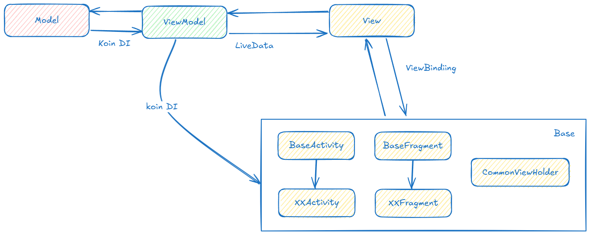
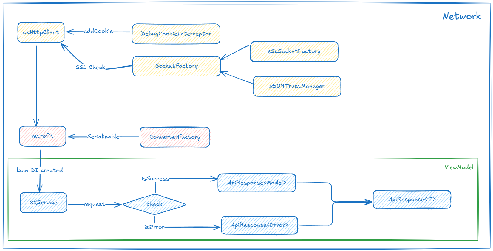
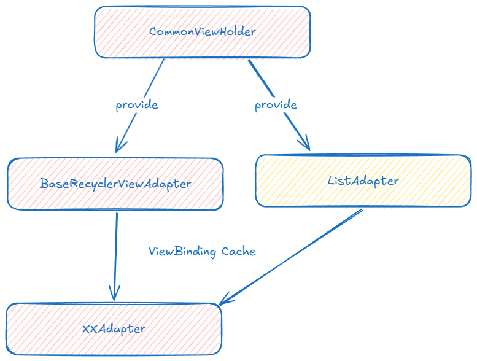
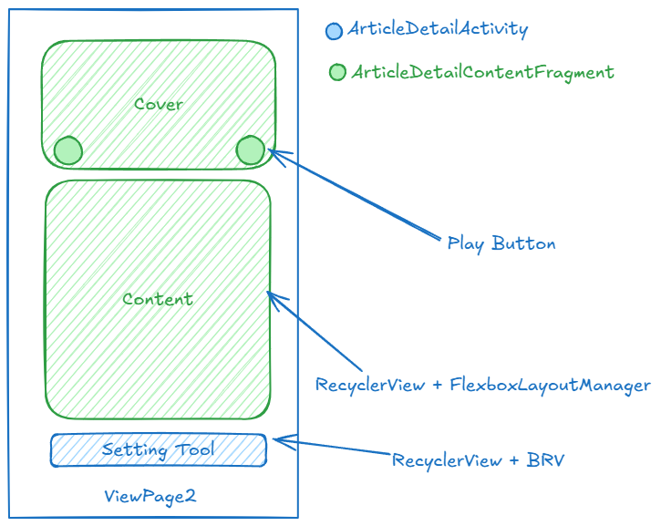

# 适趣文常详情页面Demo

此仓库仅供学习使用，请勿用于商业用途。

## 基本框架信息

## 核心封装

### 网络请求

### 列表适配器

## UI草图

## 第三方库

- [Koin](https://insert-koin.io/)
    - 依赖注入支持
- [KongzuDialogX](https://github.com/kongzue/DialogX)
    - 加载对话框
- [Glide](https://github.com/bumptech/glide)
    - Web网络图片加载
- [Retrofit2](https://github.com/square/retrofit)
    - 网络请求
    - [retrofit-converters-kotlinx-serialization-json](https://github.com/square/retrofit/tree/trunk/retrofit-converters/kotlinx-serialization)
        - Kotlin序列化支持
- [kotlinx-serialization-json](https://github.com/Kotlin/kotlinx.serialization)
    - Kotlin官方的序列化库
- [SmartRefreshLayout](https://github.com/scwang90/SmartRefreshLayout)
    - 热门的下拉刷新框架
    - 到底加载与下拉刷新实现
- [Lottie](https://lottiefiles.com/)
    - 加载动画
- [BRV](https://github.com/liangjingkanji/BRV)
    - 为设置栏的RecyclerView提供便捷的adapter
- [flexBox](https://github.com/google/flexbox-layout)
    - 为RecyclerView提供流式布局能力
- Lifestyle-ViewModel-Ktx
    - 提供ViewModel中的生命周期安全的协程作用域
- Lifestyle-Fragment-Ktx
    - 提供ViewModel委托绑定能力
